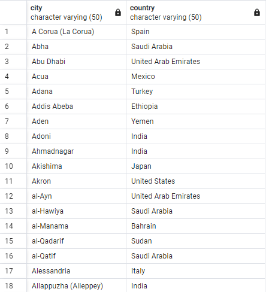
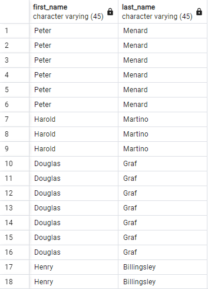
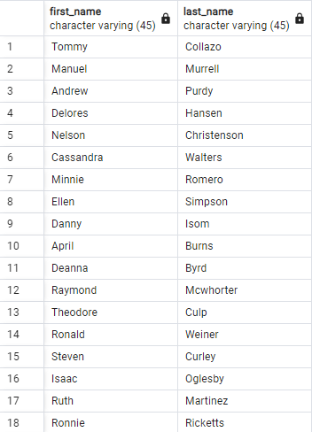

1. SELECT city, country FROM city
   INNER JOIN country ON city.country_id = country.country_id;

   

2. SELECT first_name, last_name FROM customer
   INNER JOIN payment ON customer.payment_id = payment.payment_id;

   

3. SELECT first_name, last_name FROM customer
   INNER JOIN rental ON customer.rental_id = rental.rental_id;

   

